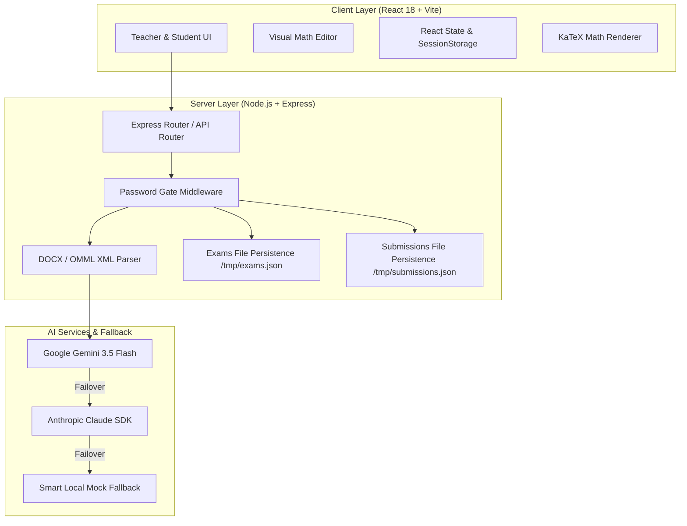

# 📐 Math Exam & Input Pipeline

An intelligent, full-stack math assessment platform that enables educators to extract, convert, edit, and publish math exams from raw text, uploaded images, and Word `.docx` files — and allows students to complete exams with real-time auto-grading.

Built with **React**, **Node.js / Express**, **KaTeX**, **Google Gemini AI**, and **Anthropic Claude**, this platform bridges the gap between raw mathematical content and interactive, zero-LaTeX web assessment.

---

## 📑 Table of Contents

- [✨ Core Features](#-core-features)
- [🏗️ System Architecture](#️-system-architecture)
- [🛠️ Tech Stack](#️-tech-stack)
- [🚀 Quick Start (5-Minute Setup)](#-quick-start-5-minute-setup)
- [⚙️ Environment Variables](#️-environment-variables)
- [📜 NPM Scripts Reference](#-npm-scripts-reference)
- [🧠 Smart AI Parsing & Fallback Mode](#-smart-ai-parsing--fallback-mode)
- [📄 DOCX (OMML/MathML) Conversion Engine](#-docx-ommlmathml-conversion-engine)
- [🔐 Access Gate & Authentication Model](#-access-gate--authentication-model)
- [🎯 Question Types & Auto-Grading Rules](#-question-types--auto-grading-rules)
- [🔌 API Endpoint Reference](#-api-endpoint-reference)
- [☁️ Deployment (Vercel & Node.js)](#️-deployment-vercel--nodejs)
- [📂 Project Directory Structure](#-project-directory-structure)
- [❓ Troubleshooting & FAQ](#-troubleshooting--faq)
- [🤝 Contributing & License](#-contributing--license)

---

## ✨ Core Features

### 👩‍🏫 For Teachers & Content Authors
- **Multi-Source Exam Parsing**: Import math questions from raw text, pasted problem sets, uploaded snapshot images, or Word documents (`.docx`).
- **Native Word Math Extraction**: Automatically extracts Microsoft Office Math Markup Language (OMML / MathML) from `.docx` files and converts formulas into clean LaTeX without loss of symbols or formatting.
- **Visual Math Editor (Zero LaTeX Required)**: Edit questions, options, and solutions using an intuitive visual block builder and rendered math formulas.
- **Flexible Question Types**: Create Multiple Choice Questions (MCQ), Numeric Short-Answer questions with custom tolerance ranges ($\pm$), and Free-Text Short-Answer questions.
- **Exam Catalogue Management**: Save, view, edit, and publish test suites with custom title tags and metadata.
- **Teacher Review Dashboard**: Inspect student submissions, review auto-graded responses, and score free-text answers flagged for manual review.

### 👨‍🎓 For Students
- **Exam-Native Test Taking**: Clean, distraction-free one-question-at-a-time interface formatted to feel like real paper exams.
- **No LaTeX Formatting Needed**: Input numerical answers or select MCQ choices directly.
- **Instant Results & Breakdown**: Immediate score summaries with question-by-question correctness checks and detailed solution breakdowns.
- **Session Persistence**: Progress is saved in session storage to prevent accidental data loss during refreshes.

---

## 🏗️ System Architecture



---

## 🛠️ Tech Stack

| Layer | Technology | Purpose |
| :--- | :--- | :--- |
| **Frontend UI** | [React 18](https://react.dev/) + [Vite](https://vitejs.dev/) | High-performance SPA with instant HMR |
| **Styling** | [Tailwind CSS](https://tailwindcss.com/) + [shadcn/ui](https://ui.shadcn.com/) | Modern design system & responsive layout |
| **Math Rendering** | [KaTeX](https://katex.org/) | Fast mathematical notation rendering |
| **Document Processing** | [JSZip](https://stuk.github.io/jszip/) | Unpacking `.docx` archives to extract `word/document.xml` |
| **Backend API** | [Node.js](https://nodejs.org/) + [Express](https://expressjs.com/) | Server routes, API gateway, file persistence |
| **Primary AI Provider** | [@google/generative-ai](https://www.npmjs.com/package/@google/generative-ai) | Vision and text extraction (`gemini-3.5-flash-lite`) |
| **Secondary AI Provider** | [@anthropic-ai/sdk](https://www.npmjs.com/package/@anthropic-ai/sdk) | Backup multi-modal extraction provider |
| **Deployment Serverless** | [Vercel Serverless Functions](https://vercel.com/) | Zero-config serverless API deployment (`/api/index.js`) |

---

## 🚀 Quick Start (5-Minute Setup)

Follow these simple steps to run the full application on your local computer.

### 1️⃣ Prerequisites
Ensure you have the following installed on your machine:
- **Node.js**: v18.0.0 or higher ([Download Node.js](https://nodejs.org/))
- **npm**: v9.0.0 or higher (comes bundled with Node.js)
- **Git**: ([Download Git](https://git-scm.com/))

### 2️⃣ Clone & Install Dependencies
Open your terminal or command prompt and run:

```bash
# Clone the repository
git clone https://github.com/YourUsername/math-input-pipeline.git
cd math-input-pipeline

# Install dependencies for root, client, and server with one command
npm run install:all
```

> 💡 **Tip for Newbie Devs**: `npm run install:all` automatically enters both the `/client` and `/server` folders to install all necessary packages so you don't have to do it manually!

### 3️⃣ Set Up Environment Variables
Create your server environment file from the provided example:

```bash
# On Linux/macOS
cp server/.env.example server/.env

# On Windows (PowerShell)
Copy-Item server\.env.example server\.env
```

Open `server/.env` in your text editor (VS Code, Notepad, etc.) and configure your passwords:

```env
PORT=5000
APP_PASSWORD=teacher123
STUDENT_PASSWORD=student123
GEMINI_API_KEY=your_gemini_api_key_here
GEMINI_MODEL=gemini-3.5-flash-lite
```

> 🔑 **No API key? No problem!** If you don't have a Gemini or Anthropic API key yet, leave `GEMINI_API_KEY` blank or as default. The server will automatically activate **Smart Demo Fallback Mode** so you can test all features right away!

### 4️⃣ Start the Application
Run the dual development server (launches both Express backend & Vite frontend simultaneously):

```bash
npm run dev
```

Once running:
- **Frontend App**: Open [http://localhost:5173](http://localhost:5173) in your browser.
- **Backend API**: Running at [http://localhost:5000](http://localhost:5000).

---

## ⚙️ Environment Variables

All backend configurations are controlled via `server/.env`. Below is the complete description of each parameter:

| Parameter | Required? | Default | Description |
| :--- | :--- | :--- | :--- |
| `PORT` | Optional | `5000` | Port for the local Express backend server. |
| `APP_PASSWORD` | Optional | *(empty)* | Password required to unlock the Teacher Authoring UI and access administrative parsing routes. |
| `STUDENT_PASSWORD` | Optional | *(empty)* | Password required for students to take published tests. |
| `GEMINI_API_KEY` | Optional | *(empty)* | Google Gemini API Key for AI text & image extraction. |
| `GEMINI_MODEL` | Optional | `gemini-3.5-flash-lite` | Gemini model ID used for visual & text processing. |
| `ANTHROPIC_API_KEY` | Optional | *(empty)* | Anthropic Claude API Key (used as fallback if Gemini fails). |

---

## 📜 NPM Scripts Reference

You can execute these commands from the root directory:

| Command | Description |
| :--- | :--- |
| `npm run dev` | Runs both the Vite client server and Node.js backend concurrently with hot reload. |
| `npm run install:all` | Installs root, client, and server dependencies in sequence. |
| `npm run build` | Builds the React frontend application for production into `client/dist`. |
| `npm run start` | Starts the standalone Express production backend server. |
| `npm run vercel-build` | Command executed by Vercel deployment pipeline to build frontend assets. |

---

## 🧠 Smart AI Parsing & Fallback Mode

The platform uses a resilient multi-tier AI parsing engine for extracting structured question schemas from unformatted text or photos:

1. **Primary AI (Google Gemini)**: Analyzes raw text or image buffers using custom system prompts to produce valid question JSON with `<math>LaTeX</math>` tags.
2. **Secondary AI (Anthropic Claude)**: If Gemini returns an error or rate limit, requests are automatically retried through Claude.
3. **Smart Demo Fallback Mode**: If no API keys are provided in `server/.env`, the system detects missing keys gracefully via `GET /api/health` and serves realistic pre-parsed mock math questions. This allows developers to test the app without incurring API fees or setup friction.

---

## 📄 DOCX (OMML/MathML) Conversion Engine

Microsoft Word documents represent mathematical formulas using **OMML** (`<m:oMath>`) inside `word/document.xml`. Standard text extractors destroy these mathematical structures.

Our custom parser engine handles Word documents seamlessly:
1. **XML Extraction**: Uses `JSZip` to extract `word/document.xml` directly from `.docx` binaries.
2. **OMML-to-LaTeX Transformer**: Traverses the XML tree and maps Word math constructs (`<m:f>` fractions, `<m:rad>` radicals, `<m:sSup>` superscripts, `<m:nary>` integrals/summations) into standard LaTeX strings (`\frac{}{}`, `\sqrt{}`, `^{}`).
3. **Structured Mapping**: Reconstructs question stems, options, and solution keys into clean JSON objects ready for rendering in KaTeX.

---

## 🔐 Access Gate & Authentication Model

To keep deployment lightweight and serverless-friendly, the platform uses a **Dual Shared Password Gate** instead of complex user database accounts:

- **Teacher Access (`APP_PASSWORD`)**: Unlocks the exam builder, `.docx` parser, catalogue editor, and grading dashboard. Sent via `x-app-password` header in API requests.
- **Student Access (`STUDENT_PASSWORD`)**: Unlocks published exams for student completion.
- **Public Endpoints**: `/api/health`, `/api/verify-password`, and `/api/verify-student-password` are accessible without credentials.

---

## 🎯 Question Types & Auto-Grading Rules

Questions are structured under strict schemas to ensure predictable grading:

| Question Type | Target Field | Auto-Graded? | Grading Criteria |
| :--- | :--- | :--- | :--- |
| `mcq` | `options[]`, `correctAnswer` | ✅ Yes | Exact match against selected option index. |
| `short_answer_numeric` | `correctAnswer`, `acceptedRange` | ✅ Yes | Evaluated using numeric range match: $min \le studentInput \le max$. |
| `short_answer_text` | `correctAnswer` | ⚠️ Manual | Flagged as `needsReview: true` for teacher evaluation in the dashboard. |

### Numeric Tolerance Range Example
A question with standard answer `10.5` can define `acceptedRange: [10.4, 10.6]`. Any student answer within this bracket is graded as correct ($100\%$), preventing unfair penalties for rounding variations.

---

## 🔌 API Endpoint Reference

### Public Routes
- **`GET /api/health`**
  Returns system health, active AI providers, and model status.
- **`POST /api/verify-password`**
  Validates teacher passcode.  
  *Body*: `{ "password": "string" }`
- **`POST /api/verify-student-password`**
  Validates student passcode.  
  *Body*: `{ "password": "string" }`

### Exam & Submission Routes
- **`GET /api/exams`** — Retrieves published exams list.
- **`POST /api/exams`** — Saves or updates an exam package.
- **`GET /api/submissions`** — Retrieves student test submissions (Teacher view).
- **`POST /api/submissions`** — Submits a completed student test attempt.

### Protected AI Parsing Routes (Requires `x-app-password` header)
- **`POST /api/parse-text`** — Parses raw text containing math into structured JSON.
- **`POST /api/parse-image`** — Processes base64 photo of exam paper using AI vision.
- **`POST /api/parse-docx`** — Parses uploaded `.docx` file into exam catalogue format.

---

## ☁️ Deployment (Vercel & Node.js)

### Deploying to Vercel (Recommended)
This repository contains a pre-configured `vercel.json` and a serverless entry point in `api/index.js`.

1. Push your code to GitHub.
2. Import your repository into [Vercel](https://vercel.com/).
3. Set Environment Variables in Vercel Dashboard:
   - `APP_PASSWORD`
   - `STUDENT_PASSWORD`
   - `GEMINI_API_KEY`
4. Click **Deploy**. Vercel will handle frontend static bundling and serverless endpoint mounting automatically.

### Deploying to Custom Node.js Server / VPS
1. Run `npm run build` to build the Vite client.
2. Set `NODE_ENV=production` in your environment.
3. Start the Express server with `npm run start`.
4. The Express server will serve static client files from `client/dist` and listen on `PORT`.

---

## 📂 Project Directory Structure

```
math-input-pipeline/
├── api/                   # Vercel serverless function entrypoint (api/index.js)
├── client/                # React 18 + Vite frontend
│   ├── src/
│   │   ├── components/    # UI components (Catalogue, Student, TeacherDashboard, VisualMathEditor)
│   │   ├── services/      # API, DOCX, OMML, and grading logic services
│   │   ├── App.jsx        # Main application component & tab router
│   │   └── main.jsx       # React entry point
│   ├── package.json
│   └── vite.config.js
├── server/                # Node.js + Express backend
│   ├── routes/            # API endpoints (exams.js, parse.js, submissions.js)
│   ├── index.js           # Express server setup & middleware
│   └── .env.example       # Sample environment configuration
├── vercel.json            # Vercel deployment configuration
├── package.json           # Root workspace package.json & runner scripts
└── README.md              # Project documentation
```

---

## ❓ Troubleshooting & FAQ

### Q1: `Error: listen EADDRINUSE: address already in use :::5000`
**Solution**: Another process is using port 5000. You can change `PORT=5001` in your `server/.env` file, or stop the existing process:
- **Windows**: `npx kill-port 5000`
- **Mac/Linux**: `lsof -i :5000 | awk 'NR>1 {print $2}' | xargs kill -9`

### Q2: Why are math formulas rendering as raw code or LaTeX string?
**Solution**: Ensure your question text encloses math formulas in `<math>...</math>` tags (e.g. `<math>x^2 + y^2 = r^2</math>`). The renderer automatically parses text inside `<math>` tags into rendered KaTeX blocks.

### Q3: Do I need a credit card or paid API key to run this?
**Solution**: No! If you don't add an API key to `server/.env`, the system runs in **Smart Demo Fallback Mode**, generating rich pre-parsed math test data so you can test all features for free.

### Q4: CORS error when fetching from frontend to backend?
**Solution**: Make sure both client and server are running via `npm run dev`. Vite automatically proxies `/api` requests to `http://localhost:5000` during local development.

---

## 🤝 Contributing & License

Contributions are welcome! If you'd like to improve the math parser, add new question types, or enhance the visual math editor:

1. Fork the project repository.
2. Create your feature branch (`git checkout -b feature/AmazingFeature`).
3. Commit your changes (`git commit -m 'Add some AmazingFeature'`).
4. Push to the branch (`git push origin feature/AmazingFeature`).
5. Open a Pull Request.

Distributed under the **MIT License**. See `LICENSE` for more information.

---

<p align="center">
  Made with ❤️ for teachers and students. Built with React, Express, KaTeX, and Gemini AI.
</p>
