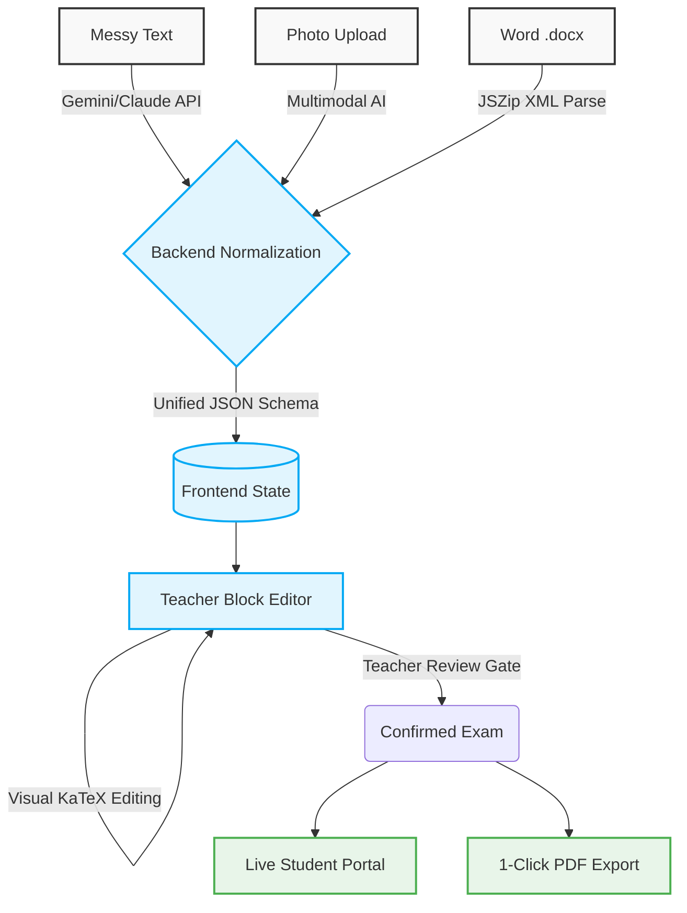

# 🚀 DLP testing pipeline

<div align="center">
  
  
  
  
  
  <br />
  <br />

  **A full-stack, exam-native web platform that enables tuition teachers to quickly create, edit, and review typeset math test questions.**

  [**View Live Deployment**](https://dlp-testing.vercel.app)

  ⚠️ **Important Note Regarding Live Site:**
  The live deployment is strictly for personal/internal use and is heavily password-protected at both the Student and Teacher portals to prevent unauthorized access and resource exhaustion. **It is not a public demo.** Please follow the Developer Setup instructions to run the pipeline locally.
</div>

---

## 📖 Table of Contents
- [✨ Features](#-features)
- [📸 Sneak Peek](#-sneak-peek)
- [🏗 Architecture & Flow](#-architecture--flow)
- [🛠 Tech Stack](#-tech-stack)
- [💻 Developer Setup (No more headaches!)](#-developer-setup-no-more-headaches)
  - [1. Clone & Install](#1-clone--install)
  - [2. Environment Variables](#2-environment-variables)
  - [3. Run the App](#3-run-the-app)
- [🧠 Project Philosophy](#-project-philosophy)
- [📄 License](#-license)

---

## ✨ Features

- **🪄 Multi-Input Ingestion Pipeline:**
  - Parse informal messy text (e.g., `x squared plus 2x = 4`).
  - Upload textbook photos/whiteboards and let multimodal AI extract the math.
  - Upload `.docx` files to deterministically extract native MS Word OMML equations.
- **📝 Google-Forms-Style Block Editor:** No separate "editing mode." What you see is what you get.
- **🚫 Zero LaTeX Required:** A floating visual math toolbar lets users edit KaTeX formulas directly. Teachers never see raw LaTeX.
- **🛡️ Mandatory Range Review Gate:** AI suggests numerical ranges, but human teachers must confirm them before a test can be published.
- **🖨️ 1-Click PDF Export:** Generate printable, exam-paper layouts instantly.

---

## 📸 Sneak Peek

*(Add your awesome GIFs here to show off the pipeline!)*

<div align="center">
  
  <p><i>The intuitive math block editor in action.</i></p>
</div>

---

## 🏗 Architecture & Flow

The DLP testing pipeline standardizes all inputs (Text, Images, DOCX) into a single unified JSON schema.



---

## 🛠 Tech Stack

**Frontend:**
- **React 18** via Vite
- **Tailwind CSS** (Custom exam-paper aesthetic palette)
- **KaTeX** (Math rendering)
- **JSZip** (Client-side `.docx` extraction)

**Backend:**
- **Node.js + Express** (Lightweight proxy to AI providers)
- **Google Gemini API** (`gemini-3.5-flash-lite`)
- **Anthropic Claude API** (`claude-sonnet-5`) - *Used as a fallback for complex reasoning*

---

## 💻 Developer Setup (No more headaches!)

We know setting up a new project can be frustrating. We've made this as painless as possible!

### 1. Clone & Install

This is a monorepo setup. The root `package.json` will handle installing dependencies for both the `client` and `server`.

```bash
git clone https://github.com/your-username/dlp-testing-pipeline.git
cd dlp-testing-pipeline

# This magic command installs root, client, and server dependencies!
npm run install:all
```

### 2. Environment Variables

You need to set up environment variables for the **backend server**.
Navigate to the `server` directory and duplicate the `.env.example` file:

```bash
cd server
cp .env.example .env
```

Now, open `server/.env` and fill in the required values:

```env
# Required for the proxy to work!
GEMINI_API_KEY=your_gemini_key_here
ANTHROPIC_API_KEY=your_anthropic_key_here

# Passwords for the portals (Local Dev)
APP_PASSWORD=teacher_pass
STUDENT_PASSWORD=student_pass
```

*Note: The frontend **never** holds API keys. All AI calls proxy safely through the backend.*

### 3. Run the App

Go back to the root directory and start the dev servers concurrently:

```bash
cd ..
npm run dev
```

- **Frontend:** Runs on `http://localhost:3000` (or the port Vite provides)
- **Backend:** Runs on `http://localhost:5000`

Boom! 🚀 You are ready to develop.

---

## 🧠 Project Philosophy

- **Exam-Native, Not App-Native:** The UI mimics an actual printed exam paper. No generic SaaS drop-shadows, no flashy gamification. Warm paper whites (`#FAF7F0`) and soft blacks (`#232323`).
- **Quiet & Reliable:** Trustworthiness comes from feeling boring and reliable, like a good photocopier.
- **Zero LaTeX Exposure:** Teachers shouldn't need to learn markup. If a math block fails to render, we show a plain English error ("this formula needs a check"), never a stack trace.

---

## 📄 License

This project is licensed under the MIT License - see the [LICENSE](LICENSE) file for details.

---
<div align="center">
  <i>Built with ❤️ for hassle-free math tuition.</i>
</div>
