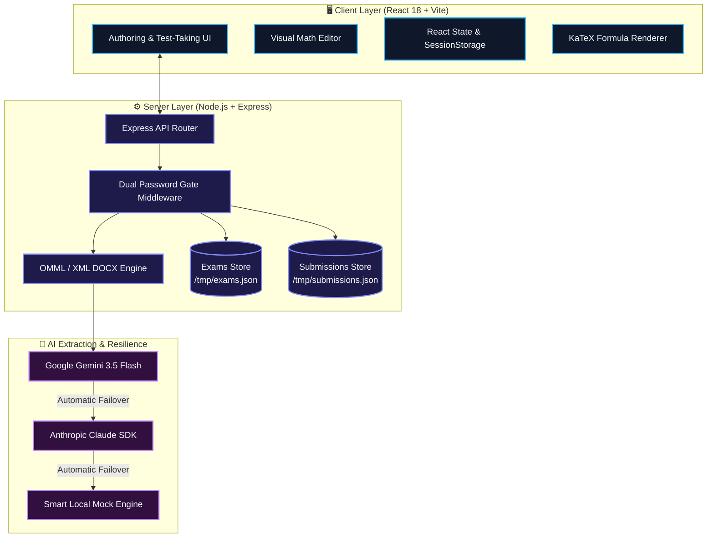

<div align="center">

# 📐 Math Exam & Input Pipeline

### *An Intelligent, Zero-LaTeX Math Assessment & AI Parsing Platform*

[](https://www.gnu.org/licenses/agpl-3.0)
[](https://react.dev/)
[](https://vitejs.dev/)
[](https://nodejs.org/)
[](https://expressjs.com/)
[](https://tailwindcss.com/)
[](https://katex.org/)
[](https://ai.google.dev/)
[](https://vercel.com/)

---

<p align="center">
  <b>Transform informal math text, photos of exam papers, and Word documents into interactive, auto-graded web assessments.</b>
</p>

[✨ Core Features](#-core-features) •
[🏗️ Architecture](#️-system-architecture) •
[🚀 5-Min Setup](#-quick-start-5-minute-setup) •
[⚙️ Env Config](#️-environment-variables) •
[🔌 API Docs](#-api-endpoint-reference) •
[☁️ Deployment](#-deployment-vercel--nodejs)

---

</div>

> [!NOTE]
> **No LaTeX Knowledge Required**: Built with an exam-native philosophy. Teachers can author, edit, and convert complex math formulas ($\frac{a}{b}$, $\sqrt{x}$, $\int f(x)dx$) using visual block components. Students get clean, distraction-free test-taking views with instant auto-grading.

---

## ✨ Core Features

<details open>
<summary><b>👩‍🏫 For Teachers & Content Authors</b></summary>

* 📄 **Multi-Source Exam Parsing**: Import math questions from raw unformatted text, pasted problem sets, photos of physical test papers, or Word documents (`.docx`).
* 📝 **Native Word OMML/MathML Processing**: Unpacks `.docx` archives directly to extract Office Math Markup Language (OMML) formulas and maps them to standard math representations without symbol loss.
* 🧩 **Visual Math Block Editor**: Modify questions, choices, and solutions using an intuitive visual block builder with real-time rendered preview.
* 🎯 **Flexible Question Types**: Author Multiple Choice Questions (MCQ), Numeric Short-Answer questions with customizable error tolerance brackets ($\pm \text{tolerance}$), and Text Short-Answer questions.
* 🗂️ **Exam Catalogue Management**: Create, update, tag, and publish test suites with title metadata.
* 📊 **Teacher Grading Dashboard**: Review auto-graded student attempts, adjust individual scores, and manually grade subjective free-text math answers.

</details>

<details open>
<summary><b>👨‍🎓 For Students & Test Takers</b></summary>

* 📝 **Exam-Native Interface**: One-question-at-a-time flow mimicking real examination conditions without confusing editor widgets.
* ⚡ **Instant Grading & Solution Breakdowns**: Immediate score calculations alongside per-question feedback and correct answer reveals.
* 🛡️ **Session Protection**: In-progress test attempts are cached in session storage so accidental page refreshes won't lose work.

</details>

---

## 🏗️ System Architecture

> [!TIP]
> **Serverless & Standalone Ready**: The system seamlessly switches between a local Express server and Vercel Serverless Functions (`api/index.js`).



---

## 🛠️ Tech Stack

| Layer | Technology | Key Capabilities |
| :--- | :--- | :--- |
| **Frontend Framework** | **React 18** + **Vite 5** | Lightning-fast HMR, component isolation, modular rendering |
| **Design System** | **Tailwind CSS** + **shadcn/ui** | Responsive dark/light theme, accessible dialogs & inputs |
| **Math Engine** | **KaTeX 0.16** | Sub-millisecond mathematical expression typesetting |
| **Document Processing** | **JSZip** | Unpacks `.docx` container files to parse `word/document.xml` |
| **Backend Gateway** | **Node.js 18+** / **Express 4** | REST API endpoints, input validation, header-based auth |
| **AI Extraction (Primary)** | **Google Gemini AI SDK** | Multimodal OCR and structured text extraction |
| **AI Extraction (Fallback)**| **Anthropic Claude SDK** | High-precision fallback for complex mathematical structures |
| **Cloud Deployment** | **Vercel Serverless** | Serverless function deployment via `api/index.js` wrapper |

---

## 🚀 Quick Start (5-Minute Setup)

> [!IMPORTANT]
> Ensure you have **Node.js v18.0+** and **npm 9+** installed on your system before proceeding.

### 1️⃣ Clone the Repository
```bash
git clone https://github.com/Sayanthegamer/dlp-testing.git
cd dlp-testing
```

### 2️⃣ Install Workspace Dependencies
Run the workspace installer to install dependencies for the root, client, and server in one command:
```bash
npm run install:all
```

### 3️⃣ Configure Environment File
Copy the sample environment file:
```bash
# On Linux/macOS:
cp server/.env.example server/.env

# On Windows (PowerShell):
Copy-Item server\.env.example server\.env
```

Open `server/.env` and update your settings:
```env
PORT=5000
APP_PASSWORD=teacher123
STUDENT_PASSWORD=student123
GEMINI_API_KEY=your_gemini_api_key_here
GEMINI_MODEL=gemini-3.5-flash-lite
```

> [!TIP]
> **No API Key? Zero Problem!** If `GEMINI_API_KEY` is omitted or left as placeholder, the server automatically enables **Smart Demo Fallback Mode**. You can test all parsing, test-taking, and grading features without spending API credits!

### 4️⃣ Launch Development Server
```bash
npm run dev
```

* 🌐 **Web Client**: `http://localhost:5173`
* 🔌 **API Server**: `http://localhost:5000`

---

## ⚙️ Environment Variables

| Variable | Required | Default Value | Description |
| :--- | :---: | :--- | :--- |
| `PORT` | Optional | `5000` | Local Express server port. |
| `APP_PASSWORD` | Optional | *(None)* | Password for unlocking Teacher Authoring & Editing tools. |
| `STUDENT_PASSWORD` | Optional | *(None)* | Password for unlocking Student Test-Taking views. |
| `GEMINI_API_KEY` | Optional | *(None)* | Google Gemini API key for text/vision OCR parsing. |
| `GEMINI_MODEL` | Optional | `gemini-3.5-flash-lite` | Model identifier for Gemini extraction. |
| `ANTHROPIC_API_KEY` | Optional | *(None)* | Anthropic Claude API key for secondary failover. |

---

## 📜 NPM Scripts Reference

```bash
# Start dev servers (Express server on :5000 + Vite client on :5173 concurrently)
npm run dev

# Install root, client, and server dependencies
npm run install:all

# Build frontend production bundle into client/dist
npm run build

# Start standalone Node.js production Express server
npm run start

# Executed by Vercel serverless pipeline during deployment
npm run vercel-build
```

---

## 📄 DOCX (OMML/MathML) Conversion Engine

Standard plain-text extractors lose equations in Microsoft Word `.docx` documents because formulas are saved in Office Math Markup Language (`<m:oMath>`).

Our pipeline preserves formulas with zero loss:

```
[ .docx File ]
      │
      ▼ (JSZip extracts word/document.xml)
[ OMML XML Tree ]
      │
      ▼ (ommlToLatex.js converts <m:f>, <m:rad>, <m:sSup>, <m:nary>)
[ Clean LaTeX Strings ]
      │
      ▼ (latexToVisualBlocks.js)
[ Rendered KaTeX & Visual Blocks ]
```

---

## 🎯 Question Types & Auto-Grading Rules

```
Question Schema
├── "type": "mcq" ──────────────────► Exact match on selected option index
├── "type": "short_answer_numeric" ──► Evaluated via range: min <= response <= max
└── "type": "short_answer_text" ────► Flagged for manual Teacher Review (needsReview: true)
```

### Numeric Tolerance Range Example
For a question with calculated answer `10.5` and tolerance $\pm 0.1$, the engine sets `acceptedRange: [10.4, 10.6]`. Any student answer within this bracket receives 100% credit automatically.

---

## 🔌 API Endpoint Reference

### 🌐 Public Endpoints

#### `GET /api/health`
Checks backend status and active AI provider keys.
<details>
<summary><b>🔍 View Response Example</b></summary>

```json
{
  "status": "ok",
  "timestamp": "2026-08-01T07:44:56.000Z",
  "hasApiKey": true,
  "providers": {
    "gemini": "active",
    "anthropic": "inactive"
  },
  "geminiModel": "gemini-3.5-flash-lite"
}
```
</details>

---

#### `POST /api/verify-password`
Verifies Teacher passcode against `APP_PASSWORD`.
* **Body**: `{ "password": "teacher123" }`

#### `POST /api/verify-student-password`
Verifies Student passcode against `STUDENT_PASSWORD`.
* **Body**: `{ "password": "student123" }`

---

### 📚 Exam & Submission Endpoints

* **`GET /api/exams`**: Fetch published exam catalogue.
* **`POST /api/exams`**: Publish or update an exam.
* **`GET /api/submissions`**: Fetch student attempt records.
* **`POST /api/submissions`**: Submit completed student test paper.

---

### 🔐 Protected AI Parsing Routes (Requires `x-app-password` Header)

#### `POST /api/parse-text`
Parses raw unformatted math text into structured JSON.

#### `POST /api/parse-image`
Processes base64 photo of physical exam paper using vision AI.

#### `POST /api/parse-docx`
Extracts and converts `.docx` Word math formulas into structured question arrays.

---

## ☁️ Deployment (Vercel & Node.js)

### 1️⃣ Deploying to Vercel (Recommended)
This repository includes a pre-configured `vercel.json` and a serverless entry point in `api/index.js`.

1. Push your repository to GitHub.
2. Import the project in [Vercel](https://vercel.com/).
3. Add Environment Variables (`APP_PASSWORD`, `STUDENT_PASSWORD`, `GEMINI_API_KEY`).
4. Click **Deploy**. Vercel will handle frontend static bundling and serverless API routing automatically.

### 2️⃣ Deploying to Standard VPS / Docker / Custom Node Server
1. Build client bundle: `npm run build`
2. Set `NODE_ENV=production`
3. Launch server: `npm run start`

---

## 📂 Project Directory Structure

```
math-input-pipeline/
├── api/                   # Vercel serverless function entrypoint (api/index.js)
├── client/                # React 18 + Vite SPA frontend
│   ├── src/
│   │   ├── components/    # Authoring, Student, Dashboard & Visual Editor UI
│   │   ├── services/      # API gateway, DOCX parsing, OMML, & grading services
│   │   ├── App.jsx        # Root application & view router
│   │   └── main.jsx       # Client entry point
│   ├── package.json
│   └── vite.config.js
├── server/                # Node.js + Express backend server
│   ├── routes/            # Exams, Submissions, and Parse routes
│   ├── index.js           # Server entry point & auth middleware
│   └── .env.example       # Sample environment configuration file
├── CODE_OF_CONDUCT.md     # Community Contributor Covenant
├── LICENSE                # GNU Affero General Public License v3.0 (AGPL-3.0)
├── vercel.json            # Vercel deployment & route configuration
└── README.md              # Project documentation
```

---

## ❓ Troubleshooting & FAQ

<details>
<summary><b>Q1: Port 5000 is already in use (EADDRINUSE)?</b></summary>

Change `PORT=5001` in `server/.env`, or free port 5000:
* **Windows (PowerShell)**: `npx kill-port 5000`
* **Linux/macOS**: `lsof -i :5000 | awk 'NR>1 {print $2}' | xargs kill -9`
</details>

<details>
<summary><b>Q2: Math formulas display as raw code?</b></summary>

Ensure math expressions in questions are wrapped in `<math>...</math>` tags (e.g. `<math>E = mc^2</math>`). The renderer automatically typesets `<math>` blocks using KaTeX.
</details>

<details>
<summary><b>Q3: Do I need a paid Gemini API Key?</b></summary>

No! Leaving `GEMINI_API_KEY` blank activates **Smart Demo Fallback Mode**, generating realistic math test data for free testing.
</details>

---

## 🤝 Contributing & License

Contributions are welcome! Please review our [Code of Conduct](file:///c:/Users/Anon/Desktop/DLP%20testing/CODE_OF_CONDUCT.md) before submitting Pull Requests.

This project is licensed under the **GNU Affero General Public License v3.0 (AGPL-3.0)**. See the [LICENSE](file:///c:/Users/Anon/Desktop/DLP%20testing/LICENSE) file for details.

---

<div align="center">

Made with ❤️ for educators and students.  
[⬆ Back to Top](#-math-exam--input-pipeline)

</div>
