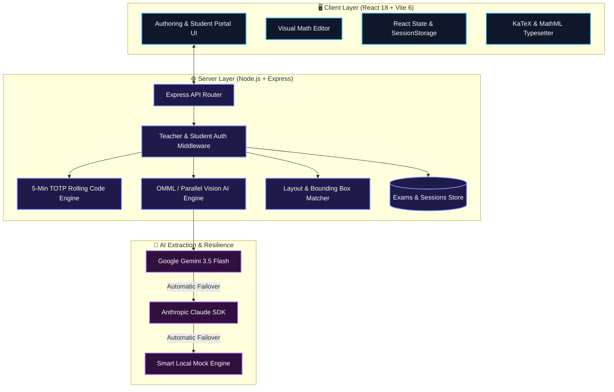

<div align="center">

# 📐 Math Exam & Input Pipeline

### *An Intelligent, Zero-LaTeX Math Assessment, AI Parsing & Student Testing Platform*

[](https://www.gnu.org/licenses/agpl-3.0)
[](https://react.dev/)
[](https://vitejs.dev/)
[](https://nodejs.org/)
[](https://expressjs.com/)
[](https://tailwindcss.com/)
[](https://katex.org/)
[](https://ai.google.dev/)
[](https://vercel.com/)

---

<p align="center">
  <b>Transform informal math text, photos of physical exam papers, multi-page PDFs, and Word documents into interactive, auto-graded web assessments with secure student authentication and 5-minute TOTP rolling passcodes.</b>
</p>

[✨ Core Features](#-core-features) •
[🏗️ Architecture](#️-system-architecture) •
[🚀 5-Min Setup](#-quick-start-5-minute-setup) •
[⚙️ Env Config](#️-environment-variables) •
[🔌 API Docs](#-api-endpoint-reference) •
[☁️ Deployment](#-deployment-vercel--nodejs)

---

</div>

> [!NOTE]
> **Zero-LaTeX Philosophy**: Authors and students can create, view, and solve complex math formulas ($\frac{a}{b}$, $\sqrt{x}$, $\int f(x)dx$, $\pu{50 V}$, $\ce{2H2 + O2 -> 2H2O}$) without typing LaTeX syntax manually. Includes automated vision layout figure extraction and robust mathematical expression typesetting.

---

## ✨ Core Features

<details open>
<summary><b>👩‍🏫 For Teachers & Content Authors</b></summary>

* 📄 **Multi-Source Exam AI Parsing**: Import math questions from raw unformatted text, pasted problem sets, multi-page PDFs (with cover page detection and automatic worked solution truncation), or Microsoft Word documents (`.docx`).
* ⚡ **Parallel Concurrency Engine**: Process multi-page PDFs concurrently via `Promise.all` parallel AI extraction to prevent serverless timeouts.
* 🖼️ **Deterministic Layout & Diagram Matcher**: Automatically extracts visual diagrams, circuit schematics, and geometric figures from documents and crops bounding boxes cleanly.
* 📝 **Native Word OMML/MathML Processing**: Unpacks `.docx` archives directly to extract Office Math Markup Language (OMML) formulas and maps them to standard math representations without symbol loss.
* 🧩 **Visual Math Block Editor**: Modify questions, choices, and solutions using an intuitive visual block builder with real-time rendered preview.
* 🎯 **Flexible Question Types**: Author Multiple Choice Questions (MCQ), Numeric Short-Answer questions with customizable error tolerance brackets ($\pm \text{tolerance}$), and Text Short-Answer questions.
* 🔒 **5-Minute TOTP Rolling Passcodes**: Teacher screens display auto-refreshing 6-digit rolling codes to protect active exam sessions against link sharing and unauthorized access.
* 📋 **Student Roster Management**: View registered students, assign unique admission numbers, and manage student accounts.

</details>

<details open>
<summary><b>👨‍🎓 For Students & Test Takers</b></summary>

* 🎓 **Student Portal Authentication**: Authenticate using Admission Number and Date of Birth (DOB) or scan digital Hall Ticket QR codes for seamless login.
* 🔑 **6-Digit Rolling Code Access**: Enter the 6-digit passcode displayed by the teacher on the whiteboard to unlock and attempt live examination papers.
* 📝 **Exam-Native Interface**: One-question-at-a-time flow mimicking real examination conditions without confusing editor widgets.
* ⚡ **Instant Auto-Grading**: Immediate score calculations alongside per-question feedback and correct answer reveals upon submission.
* 🛡️ **Session & Proctoring Protection**: In-progress test attempts are cached locally so accidental page refreshes won't lose work, backed by proctoring security guards.

</details>

---

## 🏗️ System Architecture

> [!TIP]
> **Serverless & Standalone Ready**: The system seamlessly switches between a local Express server and Vercel Serverless Functions (`api/index.js`).



---

## 🛠️ Tech Stack

| Layer | Technology | Key Capabilities |
| :--- | :--- | :--- |
| **Frontend Framework** | **React 18** + **Vite 6.2** | Sub-second HMR, modular SPA architecture, zero security vulnerabilities |
| **Design System** | **Tailwind CSS** + **shadcn/ui** | Clean dark/light theme, accessible dialogs, QR components |
| **Math Engine** | **KaTeX 0.16** + **Idempotent Sanitizer** | Sub-millisecond mathematical, `\pu{...}` unit, and `\ce{...}` chemistry typesetting |
| **Document Processing** | **JSZip** + **PDF.js** + **Sharp** | Parses `.docx` OMML XML structures and rasterizes PDF page candidate figures |
| **Backend Gateway** | **Node.js 18+** / **Express 4** | REST API endpoints, input validation, rate limiting, helmet security |
| **Security & PRNG** | **CSPRNG (`crypto.randomInt`)** | Cryptographically secure rolling codes, student admission numbers, and session tokens |
| **AI Extraction** | **Google Gemini AI SDK** | Multimodal OCR and parallel vision structured text extraction |
| **Cloud Deployment** | **Vercel Serverless** | Serverless function deployment via `api/index.js` wrapper |

---

## 🚀 Quick Start (5-Minute Setup)

> [!IMPORTANT]
> Ensure you have **Node.js v18.0+** and **npm 9+** installed on your system before proceeding.

### 1️⃣ Clone the Repository
```bash
git clone https://github.com/Sayanthegamer/dlp-testing.git
cd dlp-testing
```

### 2️⃣ Install Workspace Dependencies
Run the workspace installer to install dependencies for the root, client, and server:
```bash
npm run install:all
```

### 3️⃣ Configure Environment File
Copy the sample environment file:
```bash
# On Linux/macOS:
cp server/.env.example server/.env

# On Windows (PowerShell):
Copy-Item server\.env.example server\.env
```

Open `server/.env` and configure your keys:
```env
PORT=5000
APP_PASSWORD=teacher123
STUDENT_PASSWORD=student123
JWT_SECRET=antigravity_dlp_secret_key_2026
GEMINI_API_KEY=your_gemini_api_key_here
GEMINI_MODEL=gemini-3.5-flash-lite
```

> [!TIP]
> **No API Key? Zero Problem!** If `GEMINI_API_KEY` is omitted, the server automatically activates **Smart Demo Fallback Mode**. You can test all parsing, student testing, rolling code validation, and grading features without spending API credits!

### 4️⃣ Launch Development Servers
```bash
npm run dev
```

* 🌐 **Web Client**: `http://localhost:5173`
* 🔌 **API Server**: `http://localhost:5000`

---

## ⚙️ Environment Variables

| Variable | Required | Default Value | Description |
| :--- | :---: | :--- | :--- |
| `PORT` | Optional | `5000` | Local Express server port. |
| `APP_PASSWORD` | Optional | *(None)* | Passcode for unlocking Teacher Authoring & Editing tools. |
| `STUDENT_PASSWORD` | Optional | *(None)* | Passcode for unlocking Student Test-Taking views. |
| `JWT_SECRET` | Optional | `antigravity_dlp_secret...` | Secret key for signing student JWT authentication tokens. |
| `GEMINI_API_KEY` | Optional | *(None)* | Google Gemini API key for vision and text AI parsing. |
| `GEMINI_MODEL` | Optional | `gemini-3.5-flash-lite` | Model identifier for Gemini extraction (Invariant: `gemini-3.5-flash-lite`). |
| `ANTHROPIC_API_KEY` | Optional | *(None)* | Anthropic Claude API key for secondary failover. |

---

## 📜 NPM Scripts Reference

```bash
# Start dev servers (Express server on :5000 + Vite client on :5173 concurrently)
npm run dev

# Install root, client, and server dependencies
npm run install:all

# Build frontend production bundle into client/dist
npm run build

# Run automated vitest suite (40 unit tests)
npm run test

# Start standalone Node.js production Express server
npm run start

# Executed by Vercel serverless pipeline during deployment
npm run vercel-build
```

---

## 🔑 Student Access & 6-Digit Rolling Code Flow

```
[ Teacher Dashboard ] ──► Displays 6-Digit Code (e.g. 849201) [Auto-refreshes every 5 mins]
                                   │
                                   ▼
[ Student Portal / App ] ──► Enters Admission Number + DOB -> Logged in
                                   │
                                   ▼
[ Take Live Exam ] ────────► Inputs 6-Digit Passcode ──► Validated via POST /api/exams/student-access
                                   │
                                   ▼
[ Live Test View ] ────────► Unlocks Exam Paper & Starts Timer
```

---

## 📄 DOCX (OMML/MathML) Conversion Engine

Standard text extractors lose mathematical equations in Microsoft Word `.docx` files because formulas are stored inside XML trees (`<m:oMath>`).

Our pipeline converts formulas with zero loss:

```
[ .docx File ]
      │
      ▼ (JSZip extracts word/document.xml)
[ OMML XML Tree ]
      │
      ▼ (ommlToLatex.js converts <m:f>, <m:rad>, <m:sSup>, <m:nary>)
[ Clean LaTeX & MathML Strings ]
      │
      ▼ (mathSanitizerService.js idempotent pass)
[ Rendered KaTeX & Visual Math Blocks ]
```

---

## 🎯 Question Types & Auto-Grading Rules

```
Question Schema
├── "type": "mcq" ──────────────────► Exact match on selected option index (0 to 3)
├── "type": "short_answer_numeric" ──► Evaluated via tolerance bracket: min <= answer <= max
└── "type": "short_answer_text" ────► Flagged for manual Teacher Review (needsReview: true)
```

---

## 🔌 API Endpoint Reference

### 🌐 Public & Auth Endpoints

* **`GET /api/health`**: Checks server status and active AI providers.
* **`POST /api/auth/teacher-login`**: Authenticates teacher email/password credentials.
* **`POST /api/student-auth/login`**: Authenticates student via Admission Number + DOB.
* **`POST /api/student-auth/signup`**: Registers a new student profile with teacher passcode.

### 📚 Student Access & Exam Endpoints

* **`POST /api/exams/student-access`**: Validates student name & 6-digit rolling code to return exam paper questions.
* **`GET /api/exams/:id`**: Fetches exam snapshot (requires `x-rolling-code` header or `?code=` query param).
* **`POST /api/exams/publish`**: Publishes a new exam paper snapshot.
* **`POST /api/submissions`**: Submits completed student test paper for auto-grading.
* **`GET /api/submissions`**: Retrieves student submission history.

### 🔐 Protected AI Parsing Routes (Requires `x-app-password` Header)

* **`POST /api/parse-text`**: Parses raw unformatted text into structured questions.
* **`POST /api/parse-image`**: Transcribes base64 photos/PDFs with parallel vision AI.
* **`POST /api/parse-docx`**: Unpacks `.docx` Word OMML XML equations into structured question arrays.

---

## ☁️ Deployment (Vercel & Node.js)

### 1️⃣ Deploying to Vercel (Recommended)
This repository includes a pre-configured `vercel.json` and a serverless entry point in `api/index.js`.

1. Push your repository to GitHub.
2. Import the project in [Vercel](https://vercel.com/).
3. Set Environment Variables (`APP_PASSWORD`, `STUDENT_PASSWORD`, `JWT_SECRET`, `GEMINI_API_KEY`).
4. Click **Deploy**. Vercel will handle frontend static bundling and serverless API routing automatically.

---

## 📂 Project Directory Structure

```
dlp-testing/
├── api/                   # Vercel serverless function entrypoint (api/index.js)
├── client/                # React 18 + Vite 6.2 SPA frontend
│   ├── src/
│   │   ├── components/    # Student Portal, Catalogue, Teacher Dashboard & Math Editors
│   │   ├── services/      # API gateway, OMML parsing, & Math Sanitizer
│   │   ├── App.jsx        # Root application & view state machine
│   │   └── main.jsx       # React entry point
│   ├── package.json
│   └── vite.config.js
├── server/                # Node.js + Express backend server
│   ├── routes/            # Exams, Submissions, StudentAuth, & AI Parse routes
│   ├── services/          # Diagram cropping, layout extraction, & Math Sanitizer
│   ├── tests/             # Vitest automated test suite (40 unit tests)
│   ├── index.js           # Express server entry point & middleware
│   └── .env.example       # Sample environment configuration file
├── CODE_OF_CONDUCT.md     # Community Contributor Covenant
├── LICENSE                # GNU Affero General Public License v3.0 (AGPL-3.0)
├── vercel.json            # Vercel deployment & route configuration
└── README.md              # Project documentation
```

---

## 🤝 Contributing & License

Contributions are welcome! Please review our [Code of Conduct](file:///c:/Users/Anon/Desktop/DLP%20testing/CODE_OF_CONDUCT.md) before submitting Pull Requests.

This project is licensed under the **GNU Affero General Public License v3.0 (AGPL-3.0)**. See the [LICENSE](file:///c:/Users/Anon/Desktop/DLP%20testing/LICENSE) file for details.

---

<div align="center">

Made with ❤️ for educators and students.  
[⬆ Back to Top](#-math-exam--input-pipeline)

</div>
